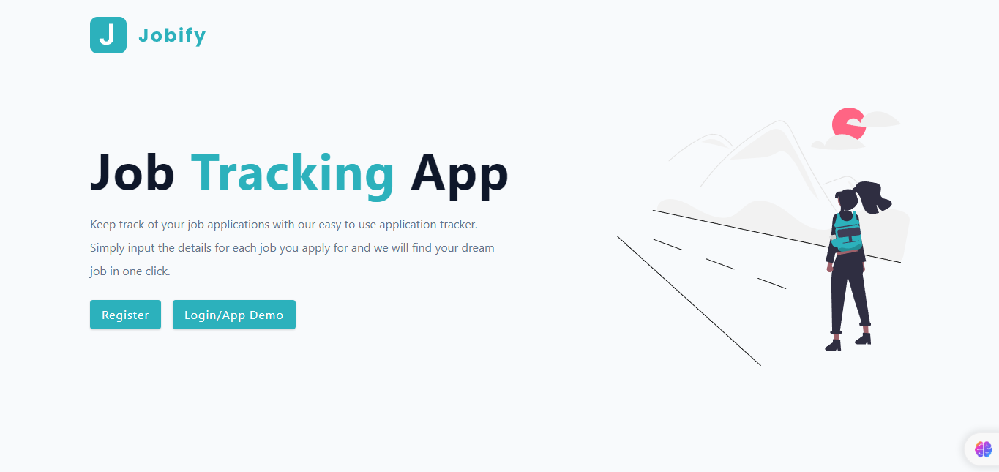
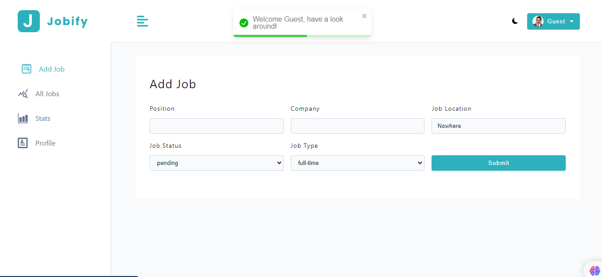
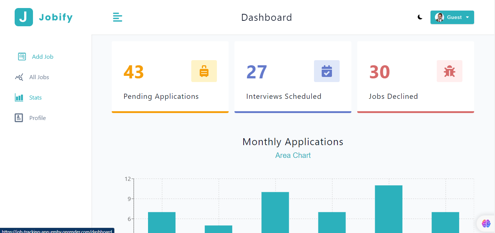

# 🧑‍💼 Jobify App


## About The Project

MERN Stack Application for tracking Job Search Process





### Features

- Login / Register
- Edit user-data
- Add jobs
- Browse user's jobs with (search + filter) feature
- Display jobs-status + monthly-applications in graphs

### 🛠️ Tools/Ferramentas

- HTML5
- CSS3
- Styled-components
- JavaScript ES6+
- Node.js
- React.js
- React Router
- Express
- MongoDB

### Ports and EndPoints

#### Ports

- FrontEnd Development Server runs on port `5173`
- BackEnd Development Server runs on port `5100`

#### API endpoints

**Main URL**: [http://localhost:5100/api/v1](http://localhost:5100/api/v1)

- **Auth**

  - Register User: [http://localhost:5100/api/v1/auth/register](http://localhost:5100/api/v1/auth/register) [POST]
  - Register User: [http://localhost:5100/api/v1/auth/login](http://localhost:5100/api/v1/auth/login) [POST]
  - Update User: [http://localhost:5100/api/v1/auth/updateUser](http://localhost:5100/api/v1/auth/updateUser) [PATCH]

- **Jobs**

  - Get all jobs: [http://localhost:5100/api/v1/jobs?status=all&jobType=all&page=1](http://localhost:5100/api/v1/jobs?status=all&jobType=all&page=1) [GET]
  - Create job: [http://localhost:5100/api/v1/jobs](http://localhost:5100/api/v1/jobs) [POST]
  - Update job: [http://localhost:5100/api/v1/jobs/:id](http://localhost:5100/api/v1/jobs/:id) [PATCH]
  - Delete job: [http://localhost:5100/api/v1/jobs/:id](http://localhost:5100/api/v1/jobs/:id) [DELETE]
  - Get stats: [http://localhost:5100/api/v1/jobs/stats](http://localhost:5100/api/v1/jobs/stats) [Get]

### Installation

#### installing Locally

1. Clone the repo

   ```sh
   git clone https://github.com/Rohit-2012/job-tracking-app.git
   ```

2. go to project folder

   ```sh
   cd job-tracking-app
   ```

3. install dependencies

   ```bash
   npm run install
   ```

4. Environmental Variables Set up

   - Here are the environmental variables that needs to be set in the `.env` file in the **server directory**.
   - These are the default setting that I used for development, but you can change it to what works for you.

   ```
     PORT=5100
     MONGO_URL=<Your mongodb url>
     JWT_EXPIRES_IN=1d
     JWT_SECRET=<any secret value of your choice>
   ```

5. Run development server

   ```sh
   npm start
   ```
